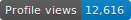
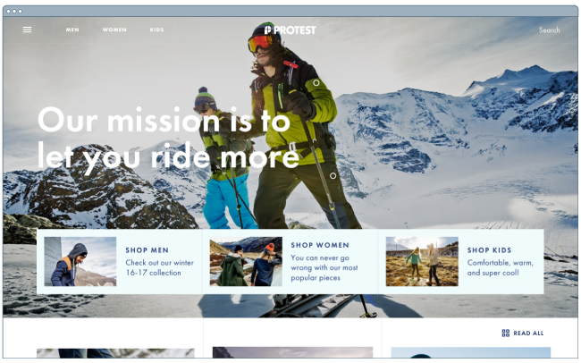
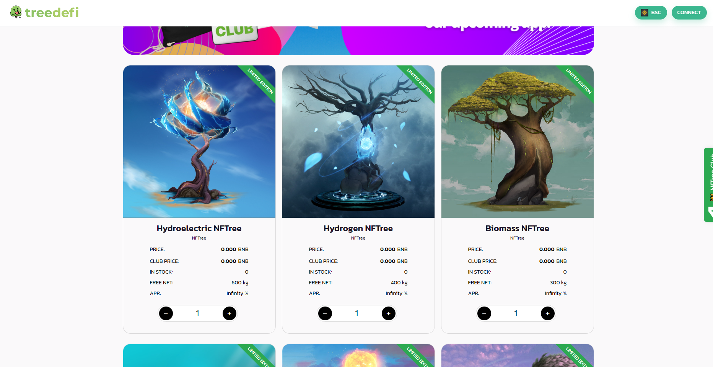
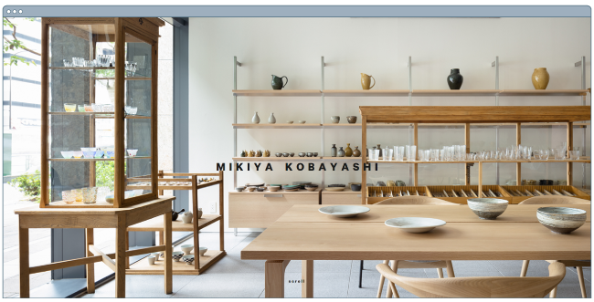

 ## FullStack & Blockchain Developer

 <a href="https://secure.joviride.com/" target="_blank" style = "width: -webkit-fill-available;">
     <!--  -->
 </a>

### :woman_technologist: &nbsp;About Me :

Kouto Kamio is a well-rounded Full-Stack developer passionate about developing quality software. He focuses on building products and his diverse skill set allows him to tackle any challenge. His major front-end skill is React, while on the back-end he has experience with Express Framework and Ruby on Rails.  

---

### 🛠 &nbsp;Languages and Tools :

&nbsp;
&nbsp;
&nbsp;
&nbsp;
&nbsp;
&nbsp;
&nbsp;
&nbsp;
&nbsp;
&nbsp;
&nbsp;
&nbsp;
&nbsp;
&nbsp;
&nbsp;
&nbsp;

---

#### MERN stack 
##### [Online-shopping(clothes)](https://www.protest.eu/)

  

#### Blockchain Developer(NFT Marketplaces) 
##### [Pocoland](https://pocoland.com/nft-market)

#### Blockchain Developer(Defi, NFT Staking, NFT Marketplace)
 

  <a href='https://dex.treedefi.com/' target='_blank'>
  </img>
  </a>
  <a href='https://nft.treedefi.com/' target='_blank'>
  </img>
  </a>
  <a href='https://nft.treedefi.com/merchandise' target='_blank'>
  </img>
  </a>

#### Vue.js 
##### [Online-Shopping](http://www.mikiyakobayashi.com/)

  

